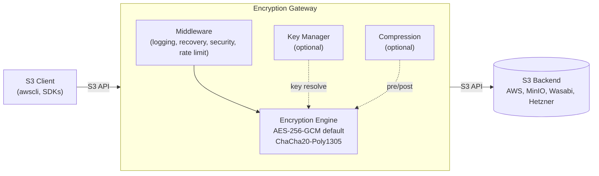
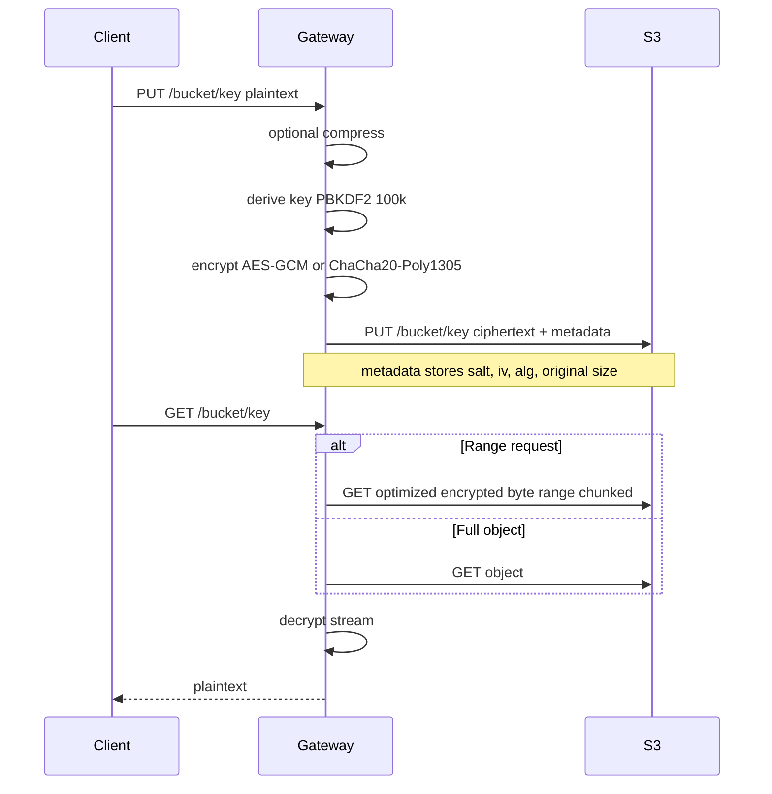

# S3 Encryption Gateway


[](LICENSE)
[](https://artifacthub.io/packages/search?repo=s3-encryption-gateway)

A transparent HTTP proxy that provides client-side encryption for S3-compatible storage services. The gateway sits between S3 clients and backend storage providers, encrypting/decrypting data transparently while maintaining full S3 API compatibility.

## Features

- **Transparent Encryption**: Automatically encrypts/decrypts S3 objects using AES-256-GCM (default) or ChaCha20-Poly1305
- **S3 API Compatible**: Full compatibility with Amazon S3 API and S3-compatible services
- **Multi-Provider Support**: Works with AWS S3, MinIO, Wasabi, Hetzner, and other S3-compatible providers
- **Client-Side Encryption**: Data is encrypted before being sent to backend storage
- **Production Ready**: Health checks, metrics, logging, and Kubernetes deployment support

## Architecture



### Data Flow (PUT/GET)



## Quick Start

### Prerequisites

- Go 1.22 or later
- Docker (optional, for containerized deployment)
- Kubernetes (optional, for K8s deployment)

### Building

```bash
# Build the binary
make build

# Or build directly
go build -o bin/s3-encryption-gateway ./cmd/server
```

### Configuration

Create a `config.yaml` file (see `config.yaml.example` for reference):

```yaml
listen_addr: ":8080"
log_level: "info"

backend:
  endpoint: "https://s3.amazonaws.com"
  region: "us-east-1"
  access_key: "YOUR_ACCESS_KEY"
  secret_key: "YOUR_SECRET_KEY"
  provider: "aws"
  use_path_style: false  # set true for some S3-compatible providers

encryption:
  password: "YOUR_ENCRYPTION_PASSWORD"
  preferred_algorithm: "AES256-GCM"   # or "ChaCha20-Poly1305"
  supported_algorithms:
    - "AES256-GCM"
    - "ChaCha20-Poly1305"

compression:
  enabled: false
  min_size: 1024
  content_types: ["text/", "application/json", "application/xml"]
  algorithm: "gzip"
  level: 6

rate_limit:
  enabled: false
  limit: 100
  window: "60s"

cache:
  enabled: false
  max_size: 104857600     # 100MB
  max_items: 1000
  default_ttl: "5m"

audit:
  enabled: false
  max_events: 10000
```

Or use environment variables:

```bash
export LISTEN_ADDR=":8080"
export BACKEND_ENDPOINT="https://s3.amazonaws.com"
export BACKEND_REGION="us-east-1"
export BACKEND_ACCESS_KEY="your-access-key"
export BACKEND_SECRET_KEY="your-secret-key"
export BACKEND_USE_PATH_STYLE=false
export ENCRYPTION_PASSWORD="your-encryption-password"
# Optional algorithm configuration
export ENCRYPTION_PREFERRED_ALGORITHM="AES256-GCM"   # or "ChaCha20-Poly1305"
export ENCRYPTION_SUPPORTED_ALGORITHMS="AES256-GCM,ChaCha20-Poly1305"
# Compression
export COMPRESSION_ENABLED=false
export COMPRESSION_MIN_SIZE=1024
export COMPRESSION_CONTENT_TYPES="text/,application/json,application/xml"
export COMPRESSION_ALGORITHM=gzip
export COMPRESSION_LEVEL=6
# Rate limiting
export RATE_LIMIT_ENABLED=false
export RATE_LIMIT_REQUESTS=100
export RATE_LIMIT_WINDOW="60s"
# Cache
export CACHE_ENABLED=false
export CACHE_MAX_SIZE=104857600
export CACHE_MAX_ITEMS=1000
export CACHE_DEFAULT_TTL="5m"
# Audit
export AUDIT_ENABLED=false
export AUDIT_MAX_EVENTS=10000
```

### Running

```bash
# Run locally
make run

# Or run directly
./bin/s3-encryption-gateway
```

### Testing

```bash
# Run all tests
make test

# Run tests with coverage
make test-coverage

# View coverage report
open coverage.html
```

## Development

### Project Structure

```
s3-encryption-gateway/
??? cmd/server/          # Main application entrypoint
??? internal/
?   ??? api/            # HTTP handlers and routing
?   ??? config/         # Configuration management
?   ??? crypto/         # Encryption/decryption logic (Phase 2)
?   ??? s3/             # S3 client implementations
?   ??? middleware/      # HTTP middleware
?   ??? metrics/        # Monitoring and metrics
??? k8s/                # Kubernetes manifests
??? docker/              # Docker-related files
??? test/                # Test utilities
```

### Development Tools

Install development tools:

```bash
make install-tools
```

Format code:

```bash
make fmt
```

Run linter:

```bash
make lint
```

Security scan:

```bash
make security-scan
```

## Docker Deployment

### Build Docker Image

```bash
make docker-build
```

### Run Docker Container

```bash
docker run -p 8080:8080 \
  -e BACKEND_ENDPOINT="https://s3.amazonaws.com" \
  -e BACKEND_REGION="us-east-1" \
  -e BACKEND_ACCESS_KEY="your-key" \
  -e BACKEND_SECRET_KEY="your-secret" \
  -e ENCRYPTION_PASSWORD="your-password" \
  s3-encryption-gateway:latest
```

## Kubernetes Deployment

### Prerequisites

- Kubernetes cluster
- kubectl configured

### Deploy

1. Create secrets (use `k8s/secrets.yaml.example` as template):

```bash
kubectl create secret generic s3-encryption-gateway-secrets \
  --from-literal=backend-access-key=YOUR_KEY \
  --from-literal=backend-secret-key=YOUR_SECRET \
  --from-literal=encryption-password=YOUR_PASSWORD
```

2. Apply ConfigMap:

```bash
kubectl apply -f k8s/configmap.yaml
```

3. Apply Deployment:

```bash
kubectl apply -f k8s/deployment.yaml
```

### Health Checks

The gateway provides health check endpoints:

- `/health` - General health status
- `/ready` - Readiness probe (for Kubernetes)
- `/live` - Liveness probe (for Kubernetes)
- `/metrics` - Prometheus metrics

### Metrics

The gateway exports comprehensive Prometheus metrics (with reduced label cardinality on HTTP paths):

- **HTTP Metrics**: Request counts, durations, bytes transferred
- **S3 Operations**: Operation counts, durations, error rates
- **Encryption**: Encryption/decryption counts, durations, throughput
- **System Metrics**: Active connections, goroutines, memory usage

Example metrics:
- `http_requests_total` - Total HTTP requests
- `encryption_operations_total` - Total encryption operations
- `active_connections` - Current active connections
- `goroutines_total` - Number of goroutines
- `memory_alloc_bytes` - Memory allocated

## API Usage

### Upload Object (PUT)

```bash
curl -X PUT http://localhost:8080/my-bucket/my-key \
  -H "Content-Type: text/plain" \
  --data "Hello, World!"
```

### Download Object (GET)

```bash
curl http://localhost:8080/my-bucket/my-key
```

### Delete Object (DELETE)

```bash
curl -X DELETE http://localhost:8080/my-bucket/my-key
```

### List Objects (GET)

```bash
curl "http://localhost:8080/my-bucket?prefix=test"
```

## Implementation Status

### Phase 1: Core Infrastructure ?
- [x] Project structure and Go modules
- [x] HTTP server with routing
- [x] S3 backend client
- [x] Configuration management
- [x] Health checks and middleware
- [x] Logging and error handling
- [x] Docker and Kubernetes deployment
- [x] Unit tests

### Phase 2: Encryption Implementation ?
- [x] AES-256-GCM encryption engine
- [x] PBKDF2 key derivation
- [x] Streaming encrypt/decrypt (chunked encryption mode)
- [x] Metadata handling

### Phase 3: S3 API Compatibility (Ongoing)
- [x] Core operations: PUT, GET, HEAD, DELETE, List
- [x] Multipart uploads (enabled with chunked encryption)
- [x] Range requests (optimized for chunked encryption: fetches only needed encrypted chunks)
- [x] Error translation

### Known limitations
- Range requests: Optimized for chunked encryption format (fetches only needed encrypted chunks from S3). Legacy encrypted objects still require full fetch + decrypt (backward compatible).
- Streaming encryption uses chunked format with per-chunk IVs; this adds ~5-20% processing overhead but enables true streaming, multipart uploads, and optimized range requests.

### Phase 4: Production Features ?
- [x] TLS/HTTPS support
- [x] Advanced monitoring and metrics (goroutines, memory usage, active connections)
- [x] Performance benchmarks
- [x] Security hardening (security headers, rate limiting)
- [x] Load testing utilities

## Security Features

### TLS/HTTPS Support
The gateway supports TLS/HTTPS encryption. Enable it in configuration:

```yaml
tls:
  enabled: true
  cert_file: /path/to/cert.pem
  key_file: /path/to/key.pem
```

Or via environment variables:
```bash
export TLS_ENABLED=true
export TLS_CERT_FILE=/path/to/cert.pem
export TLS_KEY_FILE=/path/to/key.pem
```

### Security Headers
The gateway automatically sets security headers on all responses:
- `X-Frame-Options: DENY`
- `X-Content-Type-Options: nosniff`
- `X-XSS-Protection: 1; mode=block`
- `Strict-Transport-Security` (for TLS connections)
- `Content-Security-Policy: default-src 'self'`
- `Referrer-Policy: strict-origin-when-cross-origin`

### Rate Limiting
Rate limiting can be enabled to protect against abuse:

```yaml
rate_limit:
  enabled: true
  limit: 100      # Requests per window
  window: "60s"   # Time window
```

## Security Considerations

- **Encryption Password**: Store encryption passwords securely (use secrets management)
- **Backend Credentials**: Use IAM roles or secure credential storage
- **Network**: Deploy behind TLS termination (e.g., Kubernetes Ingress) or enable built-in TLS
- **Access Control**: Restrict gateway access to authorized clients
- **Rate Limiting**: Enable rate limiting in production to prevent abuse

## Contributing

1. Fork the repository
2. Create a feature branch
3. Make your changes
4. Run tests and linter
5. Submit a pull request

See `DEVELOPMENT_GUIDE.md` for detailed development guidelines.

## License

MIT License - see [LICENSE](LICENSE) file for details.

## Support

[Add support information]