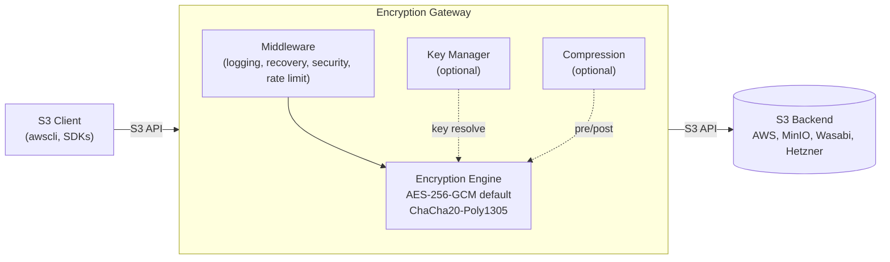
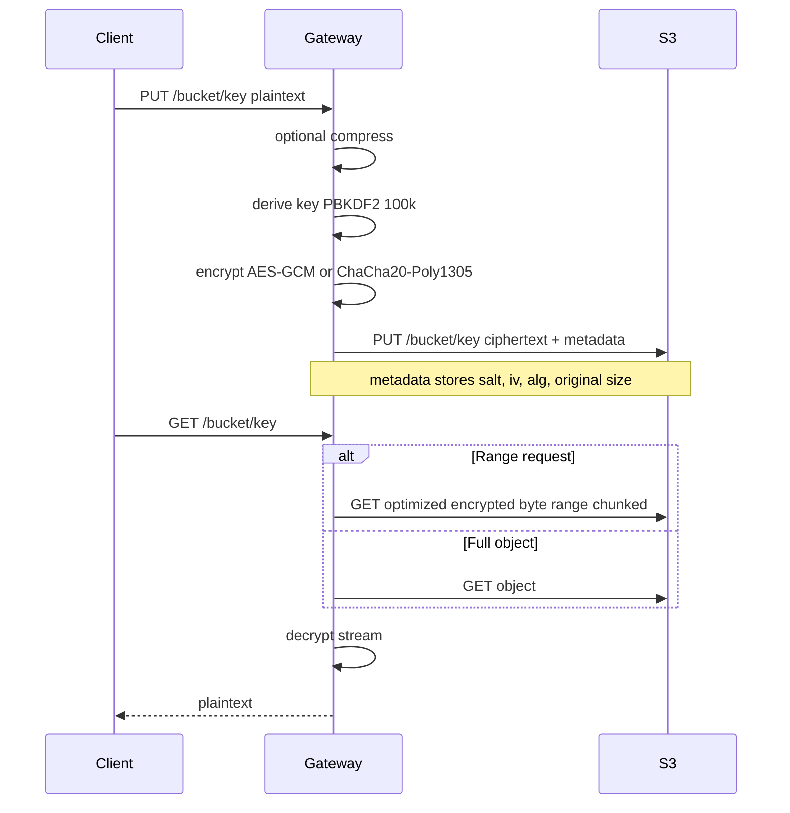

# S3 Encryption Gateway


[](LICENSE)
[](https://artifacthub.io/packages/search?repo=s3-encryption-gateway)

A production-ready HTTP proxy that provides transparent client-side encryption for S3-compatible storage services. The gateway sits between S3 clients and backend storage providers, automatically encrypting and decrypting data while maintaining full S3 API compatibility.

## Features

- **Transparent Encryption**: Automatically encrypts/decrypts S3 objects using AES-256-GCM (default) or ChaCha20-Poly1305 with authenticated encryption
- **Full S3 API Compatibility**: Supports all core operations including PUT, GET, HEAD, DELETE, List, multipart uploads, and range requests
- **Multi-Provider Support**: Works seamlessly with AWS S3, MinIO, Wasabi, Hetzner, and any S3-compatible provider
- **Client-Side Encryption**: Data is encrypted before transmission to backend storage, ensuring end-to-end security
- **Production Features**: Comprehensive monitoring, health checks, metrics, TLS/HTTPS, rate limiting, and Kubernetes-ready deployment
- **Streaming Support**: Efficient chunked encryption for large files with optimized range request handling
- **Optional Compression**: Configurable compression before encryption to reduce storage costs

## Architecture



### Data Flow (PUT/GET)



## Quick Start

### Prerequisites

- Docker (recommended), or
- Go 1.22+ for local builds

### Docker (Recommended)

The easiest way to run the gateway is using Docker:

```bash
docker run -p 8080:8080 \
  -e BACKEND_ENDPOINT="https://s3.amazonaws.com" \
  -e BACKEND_REGION="us-east-1" \
  -e BACKEND_ACCESS_KEY="your-key" \
  -e BACKEND_SECRET_KEY="your-secret" \
  -e ENCRYPTION_PASSWORD="your-password" \
  s3-encryption-gateway:latest
```

### Building from Source

```bash
# Build the binary
make build

# Or build directly
go build -o bin/s3-encryption-gateway ./cmd/server
```

### Configuration

Create a `config.yaml` file (see `config.yaml.example` for reference):

```yaml
listen_addr: ":8080"
log_level: "info"

backend:
  endpoint: "https://s3.amazonaws.com"
  region: "us-east-1"
  access_key: "YOUR_ACCESS_KEY"
  secret_key: "YOUR_SECRET_KEY"
  provider: "aws"
  use_path_style: false  # set true for some S3-compatible providers

encryption:
  password: "YOUR_ENCRYPTION_PASSWORD"
  preferred_algorithm: "AES256-GCM"   # or "ChaCha20-Poly1305"
  supported_algorithms:
    - "AES256-GCM"
    - "ChaCha20-Poly1305"

compression:
  enabled: false
  min_size: 1024
  content_types: ["text/", "application/json", "application/xml"]
  algorithm: "gzip"
  level: 6

rate_limit:
  enabled: false
  limit: 100
  window: "60s"

cache:
  enabled: false
  max_size: 104857600     # 100MB
  max_items: 1000
  default_ttl: "5m"

audit:
  enabled: false
  max_events: 10000
```

Or use environment variables:

```bash
export LISTEN_ADDR=":8080"
export BACKEND_ENDPOINT="https://s3.amazonaws.com"
export BACKEND_REGION="us-east-1"
export BACKEND_ACCESS_KEY="your-access-key"
export BACKEND_SECRET_KEY="your-secret-key"
export BACKEND_USE_PATH_STYLE=false
export ENCRYPTION_PASSWORD="your-encryption-password"
# Optional algorithm configuration
export ENCRYPTION_PREFERRED_ALGORITHM="AES256-GCM"   # or "ChaCha20-Poly1305"
export ENCRYPTION_SUPPORTED_ALGORITHMS="AES256-GCM,ChaCha20-Poly1305"
# Compression
export COMPRESSION_ENABLED=false
export COMPRESSION_MIN_SIZE=1024
export COMPRESSION_CONTENT_TYPES="text/,application/json,application/xml"
export COMPRESSION_ALGORITHM=gzip
export COMPRESSION_LEVEL=6
# Rate limiting
export RATE_LIMIT_ENABLED=false
export RATE_LIMIT_REQUESTS=100
export RATE_LIMIT_WINDOW="60s"
# Cache
export CACHE_ENABLED=false
export CACHE_MAX_SIZE=104857600
export CACHE_MAX_ITEMS=1000
export CACHE_DEFAULT_TTL="5m"
# Audit
export AUDIT_ENABLED=false
export AUDIT_MAX_EVENTS=10000
```

### Running

```bash
# Run locally
make run

# Or run directly
./bin/s3-encryption-gateway
```

## Docker Deployment

### Build Docker Image

```bash
make docker-build
```

## Kubernetes Deployment

The gateway includes Helm charts for easy Kubernetes deployment. See the [Helm chart documentation](helm/s3-encryption-gateway/README.md) for detailed deployment instructions.

### Quick Deploy

1. Create secrets:

```bash
kubectl create secret generic s3-encryption-gateway-secrets \
  --from-literal=backend-access-key=YOUR_KEY \
  --from-literal=backend-secret-key=YOUR_SECRET \
  --from-literal=encryption-password=YOUR_PASSWORD
```

2. Deploy using Helm:

```bash
helm install s3-encryption-gateway ./helm/s3-encryption-gateway
```

Or apply manifests directly:

```bash
kubectl apply -f k8s/
```

## API Usage

The gateway is fully compatible with the S3 API. Use any S3 client or SDK:

### Using AWS CLI

```bash
# Configure endpoint
aws configure set s3.endpoint_url http://localhost:8080

# Upload file
aws s3 cp file.txt s3://my-bucket/my-key

# Download file
aws s3 cp s3://my-bucket/my-key file.txt

# List objects
aws s3 ls s3://my-bucket/ --endpoint-url http://localhost:8080
```

### Using curl

```bash
# Upload object
curl -X PUT http://localhost:8080/my-bucket/my-key \
  -H "Content-Type: text/plain" \
  --data "Hello, World!"

# Download object
curl http://localhost:8080/my-bucket/my-key

# Delete object
curl -X DELETE http://localhost:8080/my-bucket/my-key

# List objects
curl "http://localhost:8080/my-bucket?prefix=test"
```

### Supported Operations

- **Core Operations**: PUT, GET, HEAD, DELETE, List Objects
- **Advanced Features**: Multipart uploads, range requests, presigned URLs
- **Compatibility**: Works with all standard S3 clients and SDKs

## Monitoring & Observability

### Health Checks

The gateway provides health check endpoints:

- `/health` - General health status
- `/ready` - Readiness probe (for Kubernetes)
- `/live` - Liveness probe (for Kubernetes)
- `/metrics` - Prometheus metrics

### Metrics

Comprehensive Prometheus metrics are exported with reduced label cardinality:

- **HTTP Metrics**: Request counts, durations, bytes transferred
- **S3 Operations**: Operation counts, durations, error rates
- **Encryption**: Encryption/decryption counts, durations, throughput
- **System Metrics**: Active connections, goroutines, memory usage

Key metrics:
- `http_requests_total` - Total HTTP requests
- `encryption_operations_total` - Total encryption operations
- `active_connections` - Current active connections
- `goroutines_total` - Number of goroutines
- `memory_alloc_bytes` - Memory allocated

## Security Features

### TLS/HTTPS Support

The gateway supports TLS/HTTPS encryption. Enable it in configuration:

```yaml
tls:
  enabled: true
  cert_file: /path/to/cert.pem
  key_file: /path/to/key.pem
```

Or via environment variables:
```bash
export TLS_ENABLED=true
export TLS_CERT_FILE=/path/to/cert.pem
export TLS_KEY_FILE=/path/to/key.pem
```

### Security Headers
The gateway automatically sets security headers on all responses:
- `X-Frame-Options: DENY`
- `X-Content-Type-Options: nosniff`
- `X-XSS-Protection: 1; mode=block`
- `Strict-Transport-Security` (for TLS connections)
- `Content-Security-Policy: default-src 'self'`
- `Referrer-Policy: strict-origin-when-cross-origin`

### Rate Limiting
Rate limiting can be enabled to protect against abuse:

```yaml
rate_limit:
  enabled: true
  limit: 100      # Requests per window
  window: "60s"   # Time window
```

## Security Considerations

- **Encryption Password**: Store encryption passwords securely using secrets management (Kubernetes Secrets, HashiCorp Vault, etc.)
- **Backend Credentials**: Use IAM roles, service accounts, or secure credential storage systems
- **Network Security**: Deploy behind TLS termination (e.g., Kubernetes Ingress) or enable built-in TLS
- **Access Control**: Restrict gateway access to authorized clients using network policies, firewalls, or API gateways
- **Rate Limiting**: Enable rate limiting in production environments to prevent abuse and ensure fair resource usage
- **Audit Logging**: Enable audit logging for compliance and security monitoring

### Encryption Details

- **Algorithm**: AES-256-GCM (default) or ChaCha20-Poly1305
- **Key Derivation**: PBKDF2 with 100,000+ iterations
- **Encryption Mode**: Chunked encryption with per-chunk IVs for streaming support
- **Range Requests**: Optimized for chunked format - fetches only needed encrypted chunks

## Contributing

We welcome contributions! Please see [`docs/DEVELOPMENT_GUIDE.md`](docs/DEVELOPMENT_GUIDE.md) for detailed development guidelines.

1. Fork the repository
2. Create a feature branch
3. Make your changes
4. Run tests and linter (`make test && make lint`)
5. Submit a pull request

## License

MIT License - see [LICENSE](LICENSE) file for details.

## Support

- **Issues**: Report bugs or request features on [GitHub Issues](https://github.com/your-org/s3-encryption-gateway/issues)
- **Documentation**: See [`docs/DEVELOPMENT_GUIDE.md`](docs/DEVELOPMENT_GUIDE.md) for development setup
- **Helm Chart**: See [Helm chart README](helm/s3-encryption-gateway/README.md) for Kubernetes deployment details